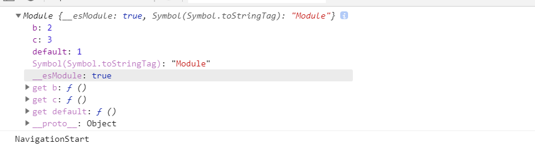

# ES6 Module 多种用法

## export

**用户需要知道所要加载的变量名或函数名，否则无法加载**

### 规定模块的对外接口，推荐使用第三种

```js
export const a = 1
export const b = 1
// 等价于
const a = 1
const b = 1
export { a }
export { b }
// 等价于
const a = 1
const b = 1
export { a, b }

import { a, b } from 'xxx'
```

### 重命名对外接口

```js
const a = 1
const b = 1
export { a as aa, b }

import { aa, b } from 'xxx'
```

## export default

**用户不需要知道所要加载的变量名或函数名**

### 为模块指定默认输出

```js
const a = 1
export default a
// 等价于
const a = 1
export { a as default }

// 这里可以使用任意变量接收
import abc from 'xxx'
```

### 默认输出和其他接口同在

在存在共存的情况下，推荐使用第二种

```js
const a = 1
const b = 1
const c = 1
export default a
export { b, c }
// 等价于
const a = 1
const b = 1
const c = 1
export { a as default, b, c }

import a, { b, c } from 'xxx'
```

## import

```js
import a from 'xxx'
import { b } from 'xxx'
import { c } from 'xxx'

import a, { b, c } from 'xxx'

import a, { b as bb, c as cc } from 'xxx'

import a, * as obj from 'xxx'
obj.default === a

import * as obj from 'xxx'
```



## 复合写法

```js
export { b, c } from 'xxx'
// 等价于
import { b, c } from 'xxx'
export { b, c }

export { default, b, c } from 'xxx'
// 等价于
import a, { b, c } from 'xxx'
export { a as default, b, c }

export { b as default, c } from 'xxx'
// 等价于
import { b, c } from 'xxx'
export { b as default, c }

export { default as a } from 'xxx'
// 等价于
import a from 'xxx'
export { a }

export * from 'xxx'
```
