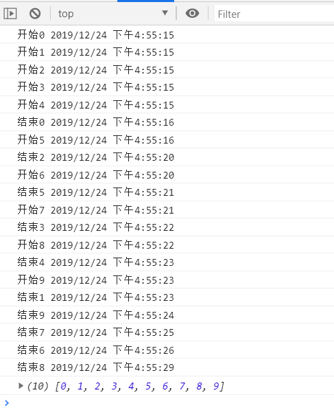
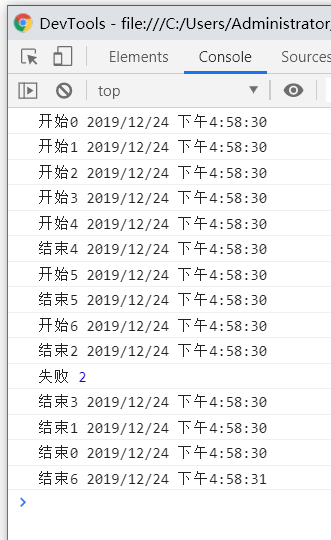

# Promise.all 并发限制

## 简介

Promise.all 可以保证，promises 数组中所有 promise 对象都达到 resolve 状态，才执行 then 回调。
这时候考虑一个场景：如果你的 promises 数组中每个对象都是 http 请求，或者说每个对象包含了复杂的调用处理。而这样的对象有几十万个。
那么会出现的情况是，你在瞬间发出几十万 http 请求（tcp 连接数不足可能造成等待），或者堆积了无数调用栈导致内存溢出。
这时候，我们就需要考虑对 Promise.all 做并发限制。
Promise.all 并发限制指的是，每个时刻并发执行的 promise 数量是固定的，最终的执行结果还是保持与原来的 Promise.all 一致。

现在已经有的成熟解决方案：`tiny-async-pool`、`es6-promise-pool`、`p-limit`

## 实现思路

主要是通过第三方插件，来控制异步函数的执行。

代码参考：`tiny-async-pool` 源码。相比于其主功能函数做了以下优化：

1、使用方式更接近原本的 `Promise.all`。

```js
function promsie1() {}
function promsie2() {}
function promsie3() {}

Promise.all([promsie1(), promsie2(), promsie3()]);
PromiseLimit([promsie1, promsie2, promsie3]);
```

2、当执行过程中某个 promise 返回 reject 则停止后续的 promise 执行。

## 代码

```js
function PromiseLimit(funcArray, limit = 5) {
  let i = 0;
  const result = [];
  const executing = [];
  const queue = function() {
    if (i === funcArray.length) return Promise.all(executing);
    const p = funcArray[i++]();
    result.push(p);
    const e = p.then(() => executing.splice(executing.indexOf(e), 1));
    executing.push(e);
    if (executing.length >= limit) {
      return Promise.race(executing).then(
        () => queue(),
        e => Promise.reject(e)
      );
    }
    return Promise.resolve().then(() => queue());
  };
  return queue().then(() => Promise.all(result));
}
```

## 效果演示

```js
// 测试代码
const result = [];
for (let index = 0; index < 10; index++) {
  result.push(function() {
    return new Promise((resolve, reject) => {
      console.log("开始" + index, new Date().toLocaleString());
      setTimeout(() => {
        resolve(index);
        console.log("结束" + index, new Date().toLocaleString());
      }, parseInt(Math.random() * 10000));
    });
  });
}

PromiseLimit(result).then(data => {
  console.log(data);
});
```



```js
// 修改测试代码 随机失败或者成功
const result = [];
for (let index = 0; index < 10; index++) {
  result.push(function() {
    return new Promise((resolve, reject) => {
      console.log("开始" + index, new Date().toLocaleString());
      setTimeout(() => {
        if (Math.random() > 0.5) {
          resolve(index);
        } else {
          reject(index);
        }
        console.log("结束" + index, new Date().toLocaleString());
      }, parseInt(Math.random() * 1000));
    });
  });
}
PromiseLimit(result).then(
  data => {
    console.log("成功", data);
  },
  data => {
    console.log("失败", data);
  }
);
```


