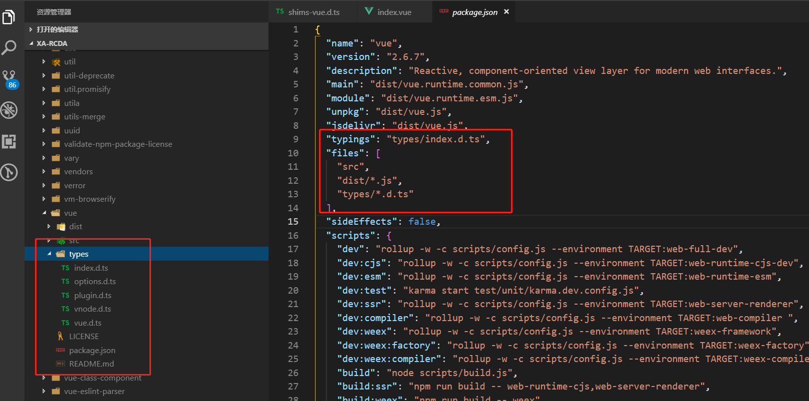
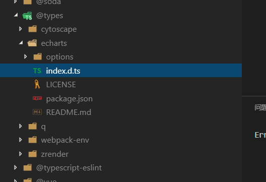

# TypeScript XXX.d.ts 文件描述

## 简介

TypeScript 的核心在于静态类型，我们在编写 TS 的时候会定义很多的类型，但是主流的库都是 JavaScript 编写的，并不支持类型系统。TypeScript 身为 JavaScript 的超集，自然需要考虑到如何让 JS 库也能定义静态类型。

TypeScript 经过了一系列的摸索，先后提出了 tsd(已废弃)、typings(已废弃)，最终在 TypeScript 2.0 的时候重新整理了类型定义，提出了 `DefinitelyTyped`。

`DefinitelyTyped` 就是让你把 类型定义文件(*.d.ts)，发布到 npm 中，配合编辑器或插件，就能够检测到 JS 库中的静态类型。类型定义文件的以 `.d.ts` 结尾，里面主要用来定义类型。

一般我们在使用第三方库的时候，主要有两种形式来表示插件的静态类型资源：

* 内置类型定义文件
  * 一般来说，类型定义文件都放在包根目录的 `types` 目录里。
  * 如果你的包有一个主 .js 文件，需要在 package.json 里指定主类型定义文件。设置 types 或 typeings 属性指向捆绑在一起的类型定义文件。
  * 如果主类型定义文件名是 index.d.ts 并且位置在包的根目录里，就不需要使用 types 属性指定了。
  * 如果你发的包中，package.json 中使用了 files 字段的话（npm 会根据 files 配置的规则决定发布哪些文件），则需要手动把类型定义文件加入。
  * 例如 Vue：

* 发布到 `@types organizatio`
  * 发布到 @types organizatio 的包表示源包没有包含类型定义文件，第三方/或原作者定义好类型定义文件之后，发布到 @types 中
  * 例如：

## 语法

### type

``` js
// 基本类型
type UserName = string

// 类型赋值
type WebSite = string
type Tsaid = WebSite

// 对象
type User = {
  name: string;
  age: number;
  website: WebSite;
}

// 方法
type say = (age: number) => string

// 类
class TaSaid {
  website: string;
  say: say;
}
```

### interface

interface 表示是对外输出的接口，可以被继承

``` js
interface BaseApplication {
    appId: number
}

export interface Application extends BaseApplication {
  init(): void

  get(key: string): object
}
```

### declare

创建 *.d.ts 文件中的变量，declare 只能作用域最外层。基本上顶层的定义都需要使用 declare。

``` js
declare var foo: number;
declare function greet(greeting: string): void;

declare namespace tasaid {
  // 这里不能 declare
  interface blog {
    website: 'http://tasaid.com'
  }
}

declare class User {
  name: string
}
```

### namespace

为防止类型重复，使用 namespace 用于划分区域块，分离重复的类型，顶层的 namespace 需要 declare 输出到外部环境，子命名空间不需要 declare。

``` js
// 命名空间
declare namespace Models {
  type A = number
  // 子命名空间
  namespace Config {
    type A = object
    type B = string
  }
}

type C = Models.Config.A
```

### module

通常来说，如果这份类型定义文件是 JS 库自带的，那么我们可以直接导出模块。而如果这份类型定义文件不是 JS 库自带的，而是第三方的，则需要使用 module 进行关联。

``` js
interface jQuery {}
declare module 'jquery' {
    export default jQuery;
}

import Vue from 'vue'
declare module '*.vue' {
  export default Vue
}
declare module 'vue/types/vue' {
  interface Vue {
    $aaa: string
  }
}
```

### 组合定义

``` js
interface ChinaMobile {
  name: string;
  website: string;
}
interface ChinaMobileList {
  // 动态属性
  [phone: string]: ChinaMobile
}

type ChinaMobilePhones = '10086' | '10010' | '10000'
interface ChinaMobile {
  name: string;
  website: string;
}
type ChinaMobileList = {
  // 遍历属性
  [phone in ChinaMobilePhones]: ChinaMobile
}

export type keys = {
  name: string;
  appId: number;
  config: object;
}
class Application {
  // 参数和值约束范围
  set<T extends keyof keys>(key: T, val: keys[T])
  get<T extends keyof keys>(key: T): keys[T]
}
```