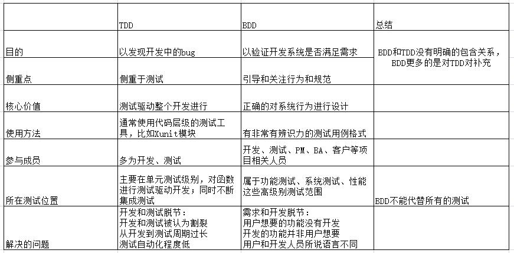
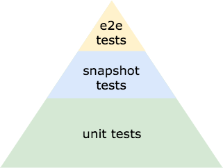

# 浅谈前端测试

## 浅谈 TDD 和 BDD

### TDD Test Driven Development (测试驱动开发)

- 一种使用自动化单元测试来推动软件设计并强制依赖关系解耦的技术。使用这种做法的结果是一套全面的单元测试，可随时运行，以提供软件可以正常工作的反馈。
- 大概的流程是先针对每个功能点抽象出接口代码，然后编写单元测试代码，接下来实现接口，运行单元测试代码，循环此过程，直到整个单元测试都通过。这一点和敏捷开发有类似之处。
- TDD 的好处很明显，它能让你减少程序逻辑方面的错误，尽可能的减少项目中的 bug。同样他要求项目的需求必须足够清晰，而且程序员对整个需求有足够的了解，如果这个条件不满足，那么执行的过程中难免失控。
- 总结：先写测试，后写程序

### BDD Behavior Driven Development (行为驱动开发)

- BDD 是一种敏捷软件开发的技术。它对 TDD 的理念进行了扩展，在 TDD 中**侧重点偏向开发**，通过测试用例来规范约束开发者编写出质量更高、bug 更少的代码。而 BDD 更加**侧重设计**，其要求在设计测试用例的时候对系统进行定义，倡导使用通用的语言将系统的行为描述出来，将系统设计和测试用例结合起来，从而以此为驱动进行开发工作。
- BDD 的通用语言是一种近乎自然语言的描述软件的形式。传统的开发模式中，客户很难从技术层面理解问题，开发人员很难从业务需求考虑问题，基于这种通用语言形式可以尽可能的避免客户和开发者在沟通上的障碍，实现客户和开发者同时定义系统的需求。避免了因为理解需求不充分而带来的不必必要的工作量。
- BDD 描述的行为就像一个个的故事(Story)。系统业务专家、开发者、测试人员一起合作，分析软件的需求，然后将这些需求写成一个个的故事。开发者负责填充这些故事的内容，测试者负责检验这些故事的结果。通常，会使用一个故事的模板来对故事进行描述。

**可能会出现的问题：当开发时间很紧的时候，开发很容易会先写代码，再补 TDD 测试，再补 BDD 测试。**

## 前端测试简述

测试是完善的研发体系中不可或缺的一环，前端同样需要测试。一个项目最终会经过快速迭代走向以维护为主的状态，在合理的时机以合适的方式引入自动化能够让我们提前发现 bug，此时定位和修复的速度比开发完再被叫去修改 bug 要快许多；在项目重构或者开发人员发生变化也能保障预期功能的实现。

前端的测试一般分为：单元测试、快照测试和端到端测试 （测试金字塔）

- 单元测试：主要用来测试我们的代码功能。单元测试是细颗粒的。
- 快照测试：将渲染的组件生成快照，并将其与组件的以前的快照进行比较。确保我们呈现正确的样式，和布局。
- 端到端测试：它们执行与我们手动测试应用程序时相同的操作。通过程序来模拟用户的操作，测试我们的程序是否按照预期的流程运行。（类似 BDD）

## 单元测试 白盒测试

我们可以采用 TDD 的开发模式来编写单元测试，但是往往我们是不具备这些先决条件，因此往往会先写程序，后补测试。这里需要注意的是在补测试的时候一定不能对照着代码逻辑去补充，因为这样你的单元测试永远都是通过的。我们应该根据我们的设计思路来补充单元测试。尽可能的进行边界测试。

- Jest
  - facebook 坐庄
  - 基于 Jasmine 至今已经做了大量修改添加了很多特性
  - 开箱即用配置少，API 简单
  - 支持断言和仿真
  - 支持快照测试
  - 在隔离环境下测试
  - 互动模式选择要测试的模块
  - 优雅的测试覆盖率报告，基于 Istanbul
  - 智能并行测试(参考)
  - 较新，社区不十分成熟
  - 全局环境，比如 describe 不需要引入直接用
  - 较多用于 React 项目(但广泛支持各种项目)
- Mocha
  - 灵活(不包括断言和仿真，自己选对应工具)
  - 流行的选择：chai，sinon
  - 社区成熟用的人多，测试各种东西社区都有示例
  - 需要较多配置
  - 可以使用快照测试，但依然需要额外配置
- Jasmine
  - 开箱即用(支持断言和仿真)
  - 全局环境
  - 比较'老',坑基本都有人踩过了
- AVA
  - 异步，性能好
  - 简约，清晰
  - 快照测试和断言需要三方支持
- Tape
  - 体积最小，只提供最关键的东西
  - 对比其他框架，只提供最底层的 API
- Karma：一个基于 Node.js 的 JavaScript 测试执行过程管理工具（Test Runner）。该工具可用于测试所有主流 Web 浏览器，也可集成到 CI（Continuous integration）工具，也可和其他代码编辑器一起使用。这个测试工具的一个强大特性就是，它可以监控文件的变化，然后自行执行，通过 console.log 显示测试结果。Karma 的一个强大特性就是，它可以监控一套文件的变换，并立即开始测试已保存的文件，用户无需离开文本编辑器。测试结果通常显示在命令行中，而非代码编辑器。这也就让 Karma 基本可以和任何 JS 编辑器一起使用。

Vue 推荐使用 Mocha + chai 或者 Jest

React 推荐使用 Jest

AngularJs 和 Angular 官方脚手架使用的是 Karma + Jasmine

因为 Karma 的特性，我们可以对 Vue 项目和 React 项目同样集成

## 快照测试

上述框架中多数都可以支持快照测试，推荐使用 Jest 或者 Mocha

## 端到端测试 黑盒测试

- Nightwatch : 是一个用于 Web 应用程序和网站的自动化测试框架，使用 Node.js 编写并使用 W3C WebDriver API（以前称为 Selenium WebDriver）。它是一个完整的浏览器（端到端）测试解决方案，旨在简化设置持续集成和编写自动化测试的过程。 Nightwatch 也可用于编写 Node.js 单元测试。
- Cypress : 是一款开箱即用，可以跑在 Chrome 浏览器上的测试工具。具有以下特点：
  - 安装简易：一行命令或者下载解压安装包就可以安装完毕
  - 依赖较少：不用安装 jdk, python 之类的东西
  - dom 选取：提供了图形化的 dom 选取工具，方便测试人员写脚本
  - 实时刷新：Cypress 检测测试用例改变后，会自动刷新
  - 报错详细：详细的报错，方便排查
- Protractor : 一个 Node.js 程序，需要安装 Node.js 才可运行。Protractor 默认使用 Jasmine 测试框架。Protractor 是基于 WebDriverJS 作了封装。是一个为 Angular 和 AngularJS 应用程序而生的端对端的测试框架，Protractor 就像用户一样在真实的浏览器中去交互并运行你的测试程序。

目前比较流行的框架是 Nightwatch 和 Cypress，在 Vue 和 React 项目中建议选择其一

Protractor 诞生之初是为 angular 程序服务，因此 AngularJs 或者 Angular 程序使用 Protractor 进行 e2e 测试
