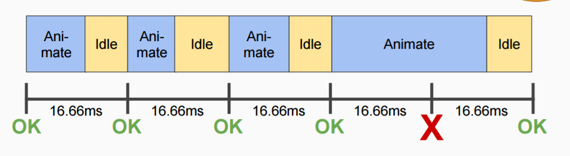
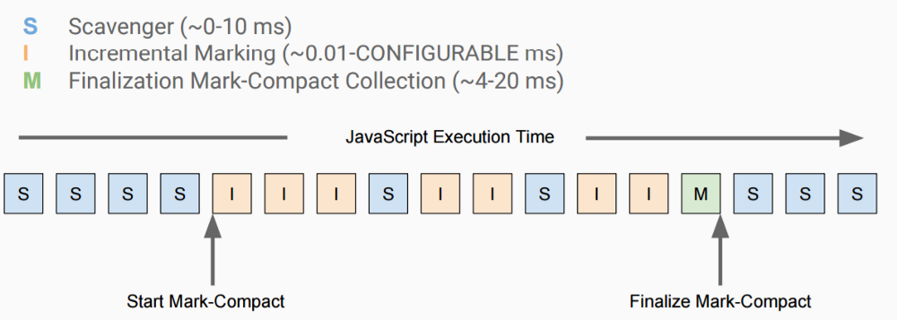

# 浏览器垃圾回收机制

## 简介

由于字符串、对象和数组没有固定大小，所有当他们的大小已知时，才能对他们进行动态的存储分配。JavaScript 程序每次创建字符串、数组或对象时，解释器都必须分配内存来存储那个实体。只要像这样动态地分配了内存，最终都要释放这些内存以便他们能够被再用，否则，JavaScript 的解释器将会消耗完系统中所有可用的内存，造成系统崩溃。

JavaScript 使用垃圾回收机制来自动管理内存。

现在各大浏览器通常用采用的垃圾回收有两种方法：标记清除、引用计数。

### 标记清除

现代浏览器大多数采用这种方式：当变量进入环境时，将变量标记"进入环境"，当变量离开环境时，标记为："离开环境"。某一个时刻，垃圾回收器会过滤掉环境中的变量，以及被环境变量引用的变量，剩下的就是被视为准备回收的变量。

### 引用计数

引用计数的含义是跟踪记录每个值被引用的次数。当声明了一个变量并将一个引用类型赋值给该变量时，则这个值的引用次数就是 1。相反，如果包含对这个值引用的变量又取得了另外一个值，则这个值的引用次数就减 1。当这个引用次数变成 0 时，则说明没有办法再访问这个值了，因而就可以将其所占的内存空间给收回来。

因为存在循环引用的情况会导致内存无法释放，需要手动值为 null，因此大多数的浏览器已经放弃这种回收方式。

## 什么时候触发垃圾回收

一般浏览器会自动触发 GC，我们不用太过关注。但是和其他语言一样，当触发 GC 的时候，浏览器就会停止工作。如果频繁触发 GC 页面就会发生抖动现象。

一般的 GC 耗时在 100ms 左右，对于一般的程序来说够了。但是对于一些流畅度要求高的程序来说就很麻烦，这就需要新引擎需要优化的地方。

## chrome 的 GC 优化

V8 引擎的垃圾回收策略主要基于分代垃圾回收机制：

- 将整个堆内存分为新生代内存和老龄代内存，所有的内存分配操作发生在新生代
- 新生代内存又分成两部分，From（使用） 空间和 To（闲置） 空间，所有的内存分配操作发生在 From 空间
- 新生代空间发生 GC（复制算法）
  - From 空间中存活的对象复制到 To 空间，释放未存活的对象
  - 转换两者的角色 From 空间变为 To 空间，To 空间变为 From 空间
  - 如果某个对象已经经历过一次复制算法，就将该对象复制到老龄代空间
  - 如果 To 空间的使用率超过了 25%，将整个空间的对象复制到老龄代空间。主要是为了角色转换之后留足分配内存的空间
- 老龄代空间发生 GC （标记清除与标记合并）
  - 主要采用标记清除算法，通过标记清除算法清理未存活的对象
  - 清除算法完成之后会使内存空间出现不连续的状态，这种内存碎片会对后续的内存分配造成问题。因此在内存空间不足的时候采用标记合并算法，将活着的对象移动到内存的一端，完成之后清除另外一端的对象
- 新生代的 GC 触发要比老龄代的频繁

* 一般浏览器要求最高 60fps，算下来每帧 16.6ms。Chrome 为了缩短 GC 时间，它尝试将工作分摊到每个空闲时间。它将检查每个帧时间（16.6 ms）的剩余时间，并尝试为 GC 做一些工作。[原文](https://medium.com/@ytshen/chrome-v8-idle-time-garbage-collection-54ba639d319f)

  - 如果垃圾收集事件可能很快发生，V8 GC 将检查每 n 个分配或 m 个时间单位。V8 GC 在任务调度程序中为事件注册空闲任务。
  - 任务调度程序将调度空闲任务并使用可用空闲时间调用给定的回调。V8 GC 将检查任务是否仍处于待处理状态，以及是否有足够的空闲时间来处理任务。

  
  

## 什么操作会引起内存泄漏

1、意外的全局变量

leak 成为一个全局变量，不会被回收。

```js
function leaks() {
  leak = 'xxxxxx'
}
```

2、闭包引起

闭包维持了 onclick 方法的内部变量，并且这个绑定在了 DOM 上。

```js
function bindEvent() {
  var obj = document.createElement('XXX')
  obj.onclick = function() {}
}

// 解决方法 1
function bindEvent() {
  var obj = document.createElement('XXX')
  obj.onclick = onclickHandler
}
function onclickHandler() {}

// 解决方法 2
function bindEvent() {
  var obj = document.createElement('XXX')
  obj.onclick = function() {}
  obj = null
}
```

3、没有清理的 DOM 元素

虽然我们用 removeChild 移除了 button 但是还在 elements 对象里保存着 button 的引用换言之, DOM 元素还在内存里面。

```js
var elements = {
  button: document.getElementById('button')
}
document.body.removeChild(document.getElementById('button'))
```

4、被遗忘的定时器或者回调

这样的代码很常见，如果 id 为 Node 的元素从 DOM 中移除。该定时器仍会存在，又因为回调函数中包含对 someResource 的引用，定时器外面的 someResource 也不会被释放。

```js
var someResource = getData()
setInterval(function() {
  var node = document.getElementById('Node')
  if (node) {
　　node.innerHTML = JSON.stringify(someResource))
  }
}, 1000)
```

5、子元素存在引用引起的内存泄露

执行完毕后，两个对象都已经离开环境，在标记清除方式下是没有问题的，但是在引用计数策略下，因为 a 和 b 的引用次数不为 0，所以不会被垃圾回收器回收内存，如果 fn 函数被大量调用，就会造成内存泄露。

```js
function fn() {
  var a = {}
  var b = {}
  a.pro = b
  b.pro = a
}
fn()
```
