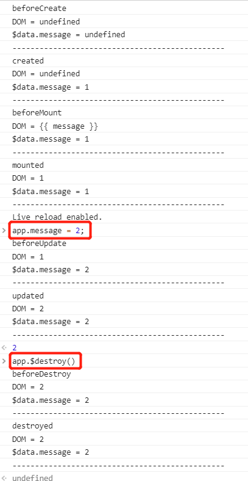

# Vue 声明周期和钩子函数

```html
<!DOCTYPE html>
<html lang="en">

<head>
    <meta charset="UTF-8">
    <meta name="viewport" content="width=device-width, initial-scale=1.0">
    <meta http-equiv="X-UA-Compatible" content="ie=edge">
    <title>Document</title>
</head>

<body>
    <div id="app">
        <p>{{ message }}</p>
    </div>
    <script src="https://cdn.jsdelivr.net/npm/vue@2.5.16/dist/vue.js"></script>
    <script>
        var app = new Vue({
            el: '#app',
            data: {
                message: "1"
            },
            beforeCreate: function () {
                console.log('beforeCreate');
                console.log("DOM = " + (this.$el && this.$el.innerText));
                console.log("$data.message = " + (this.$data && this.$data.message));
                console.log('-----------------------------------------------');
            },
            created: function () {
                console.log('created');
                console.log("DOM = " + (this.$el && this.$el.innerText));
                console.log("$data.message = " + (this.$data && this.$data.message));
                console.log('-----------------------------------------------');
            },
            beforeMount: function () {
                console.log('beforeMount');
                console.log("DOM = " + (this.$el && this.$el.innerText));
                console.log("$data.message = " + (this.$data && this.$data.message));
                console.log('-----------------------------------------------');
            },
            mounted: function () {
                console.log('mounted');
                console.log("DOM = " + (this.$el && this.$el.innerText));
                console.log("$data.message = " + (this.$data && this.$data.message));
                console.log('-----------------------------------------------');
            },
            beforeUpdate: function () {
                console.log('beforeUpdate');
                console.log("DOM = " + (this.$el && this.$el.innerText));
                console.log("$data.message = " + (this.$data && this.$data.message));
                console.log('-----------------------------------------------');
            },
            updated: function () {
                console.log('updated');
                console.log("DOM = " + (this.$el && this.$el.innerText));
                console.log("$data.message = " + (this.$data && this.$data.message));
                console.log('-----------------------------------------------');
            },
            beforeDestroy: function () {
                console.log('beforeDestroy');
                console.log("DOM = " + (this.$el && this.$el.innerText));
                console.log("$data.message = " + (this.$data && this.$data.message));
                console.log('-----------------------------------------------');
            },
            destroyed: function () {
                console.log('destroyed');
                console.log("DOM = " + (this.$el && this.$el.innerText));
                console.log("$data.message = " + (this.$data && this.$data.message));
                console.log('-----------------------------------------------');
            }
        })
    </script>
</body>

</html>
```



- `beforeCreate` : 组件实例刚被创建。属性和 DOM 都没有被初始化。
- `created` : 组件实例创建完成。属性绑定成功、DOM 未初始化。
- `beforeMount` : 模板挂载之前。属性绑定成功、DOM 未渲染。
- `mounted` : 模板挂载完成。属性绑定成功、DOM 渲染成功。
- `beforeUpdate` : 组件更新之前。属性更新成功、DOM 未更新
- `updated` : 组件更新完成。属性和 DOM 更新成功
- `beforeDestory` : 组件销毁前调用。属性和 DOM 依然存在。
- `destoryed` : 组件已销毁。属性和 DOM 依然存在。
