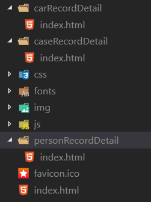

# Vue 预渲染

## 预渲染 VS SSR

### 预渲染

* 更好的 SEO
* 相比 SSR 非常简单，对代码的改造非常小
* 应用的路由比较少或者只需要优化个别路由
* 内容到达时间(time-to-content) 要求不是很高

### SSR 服务端渲染

* 相对于预渲染，SSR有更快的内容到达时间(time-to-content)
* 开发条件所限：浏览器特定的代码，只能在某些生命周期钩子函数中使用；一些外部扩展库可能需要特殊处理，才能在服务器渲染应用程序中运行
* 涉及构建设置和部署的更多要求
* 更多的服务器端负载
* 在现成的代码下改造的工作量很大

总结：例如，如果你正在构建一个内部仪表盘，初始加载时的额外几百毫秒并不重要，这种情况下去使用服务器端渲染 (SSR) 将是一个小题大作之举。然而，内容到达时间 (time-to-content) 要求是绝对关键的指标，在这种情况下，服务器端渲染 (SSR) 可以帮助你实现最佳的初始加载性能。

## 如何实现

* 安装插件 `yarn add prerender-spa-plugin`
* 应用程序路由使用 `history` 模式
* 需要保证 `App.js` 中的 template 的根节点有 `id="app"`，或者你程序对应的启动 ID 名
* 修改构建时候的配置，添加插件的相关信息

``` js
// vue-cli 3
// vue.config.js
const PrerenderSPAPlugin = require('prerender-spa-plugin')

const Renderer = PrerenderSPAPlugin.PuppeteerRenderer
const path = require('path')

module.exports = {
  productionSourceMap: false,
  configureWebpack(config) {
    if ('production' === process.env.NODE_ENV) {
      config.plugins.push(
        new PrerenderSPAPlugin({
          staticDir: path.join(__dirname, 'dist'),
          routes: ['/', '/carRecordDetail', '/caseRecordDetail', '/personRecordDetail'],
          renderer: new Renderer({
            headless: false,
            renderAfterTime: 5000
          })
        })
      )
    }
  }
}

```

## 常用配置详解

* `staticDir` : 预渲内容的输出地址
* `routes` : 需要渲染的路由
* `server` : 服务端的代理，用于发送请求
* `renderer` : 渲染器
  * `headless` : false 情况下会打开浏览器，方便我们调试是否渲染的数据准确
  * `renderAfterTime` : 等待多少秒之后去开始渲染，设置合适的事件方便我们等待请求返回数据
  * `renderAfterElementExists` : 当存在某个元素的时候开始渲染
  * `renderAfterDocumentEvent` : 当初发某个事件的时候开始渲染。在合适的地方调用 `document.dispatchEvent(new Event('custom-render-trigger'))` 事件。需要保持事件名称和设置的名称一致
* [更多内容](https://github.com/chrisvfritz/prerender-spa-plugin)

## 运行原理



* 打包出内容相对于原本的信息之外，额外添加了对应路由的 index.html 文件
* 这些文件**每一个都是我们的应用程序入口**。
* 相当于我们可以通过多个入口去访问我们的 SPA 程序
* 每个入口访问的程序后续操作和反应都是一致的
* 当我们一开始访问不同的路由时候，这时候就会加载对应的 index.html 文件，实现类似静态页面的效果
* 当网络爬虫爬去 `www.xxx.xx/aaa` 页面的时候，就会加载到 `aaa/index.html`

## 遇到的坑

* 一定要使用 `history` 路由模式
* 一定要保证 `App.js` 中的 template 的根节点有 `id="app"`，或者你程序对应的启动 ID 名。因为如果没有这个 ID 渲染出来的页面根元素就没有这个 ID ，就无法启用你的 Vue 程序，这时候的页面真的就是一个静态页面了什么操作都无效
* 安装 `prerender-spa-plugin` 失败，实际上是安装它的依赖 `puppeteer` 失败。这个插件需要下载 `Chromium`。[解决方案](https://www.jianshu.com/p/d69b1d8bc2a6)

注意：`prerender-spa-plugin` 不仅仅只能使用在 `Vue` 项目。类似的 webpace 构建的应用也可以使用。例如：`react` `Angular`