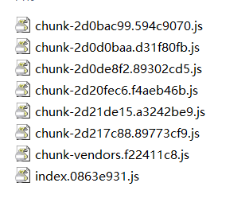
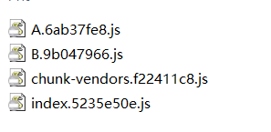

# 路由懒加载的小技巧

一般来说当我们的项目越来越大的时候，我们打包的文件也越来越大。这时候我们的首屏加载就会很慢。因此我们会使用到路由的懒加载机制来对我们的模块进行划分。

``` js
export default new Router({
  mode: 'history',
  base: process.env.BASE_URL,
  routes: [
    {
      path: '/A',
      component: () => import('./components/A.vue'),
      children: [
        {
          path: 'A1',
          component: () => import('./components/A1')
        },
        {
          path: 'A2',
          component: () => import('./components/A2')
        }
      ]
    },
    {
      path: '/B',
      component: () => import('./components/B'),
      children: [
        {
          path: 'B1',
          component: () => import('./components/B1')
        },
        {
          path: 'B2',
          component: () => import('./components/B2')
        }
      ]
    }
  ]
})
```

如上图我们使用了路由懒加载，但是这样就会导致打包出 6 个 chunk 块。项目越来越大就会导致 chunk 块越来越大。如下如：



因此：我们是否能否根据顶级路由作为一个模块，将其子路由的模块打包到一起？

/* webpackChunkName: "A" */  这个指定了打包chunk块的名字，这样我们就能将同类路由下的左键打包到同一个 chunk 快

``` js
export default new Router({
  mode: 'history',
  base: process.env.BASE_URL,
  routes: [
    {
      path: '/A',
      component: () => import(/* webpackChunkName: "A" */ './components/A.vue'),
      children: [
        {
          path: 'A1',
          component: () => import(/* webpackChunkName: "A" */ './components/A1')
        },
        {
          path: 'A2',
          component: () => import(/* webpackChunkName: "A" */ './components/A2')
        }
      ]
    },
    {
      path: '/B',
      component: () => import(/* webpackChunkName: "B" */ './components/B'),
      children: [
        {
          path: 'B1',
          component: () => import(/* webpackChunkName: "B" */ './components/B1')
        },
        {
          path: 'B2',
          component: () => import(/* webpackChunkName: "B" */ './components/B2')
        }
      ]
    }
  ]
})

```

