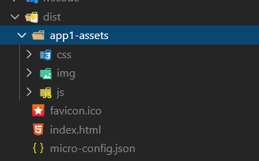

# 微前端

## 简介

借鉴微服务的概念来应用在前端上，将一个巨大的前端工程拆分成一个的小工程，这些小工程具备独立的开发和运行能力，而整个系统就由这些小工程协同合作。

优点:

- **应用自治** : 只需要遵循统一的接口规范或者框架，以便于系统集成到一起，相互之间是不存在依赖关系的。
- **单一职责** : 每个前端应用可以只关注于自己所需要完成的功能。
- **技术栈无关** : 你可以使用 Angular 的同时，又可以使用 React 和 Vue。

缺点:

- 应用的拆分基础依赖于基础设施的构建，一旦大量应用依赖于同一基础设施，那么维护变成了一个挑战。
- 拆分的粒度越小，便意味着架构变得复杂、维护成本变高。
- 技术栈一旦多样化，便意味着技术栈混乱。

## 代码实现

### 技术简介

- `single-spa` : 一个基于 JavaScript 的微前端框架，他可以用于构建可共存的微前端应用，每个前端应用都可以用自己的框架编写，完美支持 Vue React Angular。可以实现服务注册、事件监听、子父组件通信等功能。
  - 使用在公共项目或者父级项目，用来集成子项目。
  - 子项目需要输出这些方法 `bootstrap` `mount` `unmount` `update`等，父级项目使用这些方法加载、删除和更新子项目。**一般只需要使用前三个方法即可**。
- `single-spa-vue | single-spa-react | single-spa-angular-cli` : 使用在子项目中，帮助对应的子系统生成对应的 `bootstrap` `mount` `unmount` 等方法。

我们以 vue 为例子。

### 改造父级项目

- 新建一个 js 用来注册子级项目，引入到 main.js 中，这里我们叫 micro-config.js。**这里有个需要注意的地方，registerApplication 中子项目注册函数在加载对应的 JS 文件，需要保证加载的顺序，以 Vue 为例最后加载 app.[hash].js 这个文件。**

  ```js
  import { registerApplication, start } from "single-spa";

  const loadJS = async url =>
    new Promise((resolve, reject) => {
      const script = document.createElement("script");
      script.src = url;
      script.onload = resolve;
      script.onerror = reject;
      document.body.appendChild(script);
    });

  registerApplication(
    "app1",
    async () => {
      await loadJS("http://127.0.0.1:8080/对应 app1 JS1");
      await loadJS("http://127.0.0.1:8080/对应 app1 JS2");
      await loadJS("http://127.0.0.1:8080/对应 app1 JS3");
      // js 执行之后注册的主模块
      return window.app1;
    },
    location => {
      // 根据路由来判断当前子项目是否激活，我们这里使用的是 hash 路由
      return location.hash.startsWith(`#/app1`);
    }
  );
  registerApplication(
    "app2",
    async () => {
      await loadJS("http://127.0.0.1:8080/对应 app2 JS1");
      return window.app2;
    },
    location => location.hash.startsWith(`#/app2`)
  );
  start();
  ```

- 项目中对应的位置添加对应的 dom，用于加载对应的子项目。
  ```html
  <div id="app1"></div>
  <div id="app2"></div>
  ```

### 改造子级项目

- 修改主函数用于输出对应的方法。**需要注意的是对应的 el 需要和父级保持一致。为了方便我们为每个项目起个名字，对应的地方都是用项目名称。**

  ```js
  const vueOptions = {
    el: "#app1",
    router,
    render: h => h(App)
  };

  if (!window.singleSpaNavigate) {
    // 根据 singleSpaNavigate 判断到底是微前端加载还是独立运行
    delete vueOptions.el;
    new Vue(vueOptions).$mount("#app1");
  }

  const vueLifecycles = singleSpaVue({
    Vue,
    appOptions: vueOptions
  });

  export const bootstrap = [vueLifecycles.bootstrap];
  export const mount = [vueLifecycles.mount];
  export const unmount = [vueLifecycles.unmount];
  ```

- 修改对应的打包配置文件，将项目打包成 umd 文件。用于将代码注册到 window。

  ```js
  module.exports = {
    configureWebpack: {
      output: {
        library: "app1",
        libraryTarget: "umd"
      }
    }
  };
  ```

- 修改对应的路由文件，所有的路由都加上项目名称的前缀

```js
const routes = [
  {
    path: "/app1",
    name: "Home",
    component: Home
  },
  {
    path: "/app1/about",
    name: "About",
    component: About
  }
];
```

## stats-webpack-plugin 优化子项目注册

这个插件将打包之后的文件输出到一个指定的文件中。

```js
const StatsPlugin = require("stats-webpack-plugin");

module.exports = {
  configureWebpack: {
    output: {
      library: "app1",
      libraryTarget: "umd"
    },
    plugins: [
      // 输出到 micro-config.json 中
      new StatsPlugin("micro-config.json", {
        chunkModules: false,
        entrypoints: true,
        source: false,
        chunks: false,
        modules: false,
        assets: false,
        children: false,
        exclude: [/node_modules/]
      })
    ]
  }
};
```

生成的文件中我们只需要使用 `entrypoints.app.assets`

同时这里的数组顺序已经是调整好的顺序，保证我们的主代码一定是最后一个。父项目只用按照这个顺序加载就行。

```json
{
  ...,
  "entrypoints": {
    "app": {
      "chunks": ["chunk-vendors", "app"],
      "assets": [
        "js/chunk-vendors.7260770b.js",
        "css/app.b65f3c41.css",
        "js/app.b878c65b.js"
      ],
      "children": {},
      "childAssets": {}
    }
  },
  ...
}
```

改造我们父项目的子项目注册方式

```js
import { registerApplication, start } from "single-spa";
import axios from "axios";

const loadJS = async url =>
  new Promise((resolve, reject) => {
    const script = document.createElement("script");
    script.src = url;
    script.onload = resolve;
    script.onerror = reject;
    document.body.appendChild(script);
  });

const loadCSS = url => {
  const link = document.createElement("link");
  link.href = url;
  link.rel = "stylesheet";
  document.querySelector("head").appendChild(link);
};

function load(app, assets) {
  return Promise.all(
    assets.map(url => {
      const temp = `${app.enter}/${url}`;
      if (/\.css$/.test(temp)) {
        loadCSS(temp);
        return Promise.resolve();
      }
      return loadJS(temp);
    })
  ).then(() => {
    if (!window[app.name]) {
      return load(app, assets);
    }
    return window[app.name];
  });
}

const apps = [
  {
    name: "app1",
    enter: "http://127.0.0.1:8080"
  }
];

Promise.all(
  apps.map(app =>
    axios.get(`${app.enter}/micro-config.json`).then(data => {
      const { assets } = data.data.entrypoints.app;
      registerApplication(
        app.name,
        () => load(app, assets),
        location => location.hash.startsWith(`#/${app.name}`)
      );
    })
  )
).then(() => {
  start();
});
```

## 静态资源隔离

子项目肯定要加载自己对应的静态资源，例如图片。例如这个地址 `/css/img/img1.jpg`。在子项目独立运行时候肯定是没有问题的，但是如果集成运行的时候就会找不到对应的资源或者加载错误。因为他会在父级项目中寻找这个文件。

子项目修改打包之后资源的位置，以 Vue 为例：

```js
module.exports = {
  assetsDir: "app1-assets"
};
```

这样打包之后就是这个样子：


这样父级项目部署的时候添加对应的代理，就能找对具体的资源，类似如下的配置：

```js
module.exports = {
  devServer: {
    proxy: {
      "/app1-assets": {
        target: "http://127.0.0.1:8080",
        changeOrigin: true
      }
    }
  }
};
```

效果如下：


**同理使用类似的方式解决接口请求问题。**

## 样式隔离

防止父子项目的样式互相影响。使用 postcss 的插件 postcss-selector-namespace 为我们的样式添加对应的 namespace

```js
const StatsPlugin = require("stats-webpack-plugin");
const selectorNamespace = require("postcss-selector-namespace");

module.exports = {
  assetsDir: "app1-assets",
  configureWebpack: {
    output: {
      library: "app1",
      libraryTarget: "umd"
    },
    plugins: [
      new StatsPlugin("micro-config.json", {
        chunkModules: false,
        entrypoints: true,
        source: false,
        chunks: false,
        modules: false,
        assets: false,
        children: false,
        exclude: [/node_modules/]
      })
    ]
  },
  css: {
    loaderOptions: {
      postcss: {
        plugins: [
          selectorNamespace({
            namespace(css) {
              /* 无需添加的样式 */
              if (css.includes("element-variables.scss")) return "";
              return "#app1";
            }
          })
        ]
      }
    }
  }
};
```

这样打包之后的 css 就是这个样子：

```css
.mb-20 {
  margin-bottom: 20px;
}
.bg {
  min-height: 100px;
  background-image: url(../../app1-assets/img/img1.e099fa95.jpg);
}

/* 转换之后 */

#app1 .mb-20 {
  margin-bottom: 20px;
}
#app1 .bg {
  min-height: 100px;
  background-image: url(../../app1-assets/img/img1.e099fa95.jpg);
}
```

## 数据共享

父级给子级传递数据

```js
registerApplication(
  app.name,
  () => load(app, assets),
  location => location.hash.startsWith(`#/${app.name}`),
  // 传递的数据
  { a: 1, b: 2 }
);
```

子级接受处理

```js
export const mount = [
  vueLifecycles.mount,
  data => {
    // 在这里处理数据
    console.log(data);
  }
];
```

## JS 隔离

主要是为了防止父 子项目互相污染全局变量等等，具体操作方式。在对应的子项目中处理。另外尽量别使用 window 来存储相关的变量。

```js
export const mount = [
  vueLifecycles.mount,
  data => {
    // 在这里将可能影响的变量生成一个快照
  }
];
export const unmount = [
  vueLifecycles.mount,
  data => {
    // 在这里恢复快照内容
  }
];
```

**另外子项目在开发时候通过 `window.singleSpaNavigate` 这个变量来处理代码，保证集成运行时候只加载到对应的资源。**
